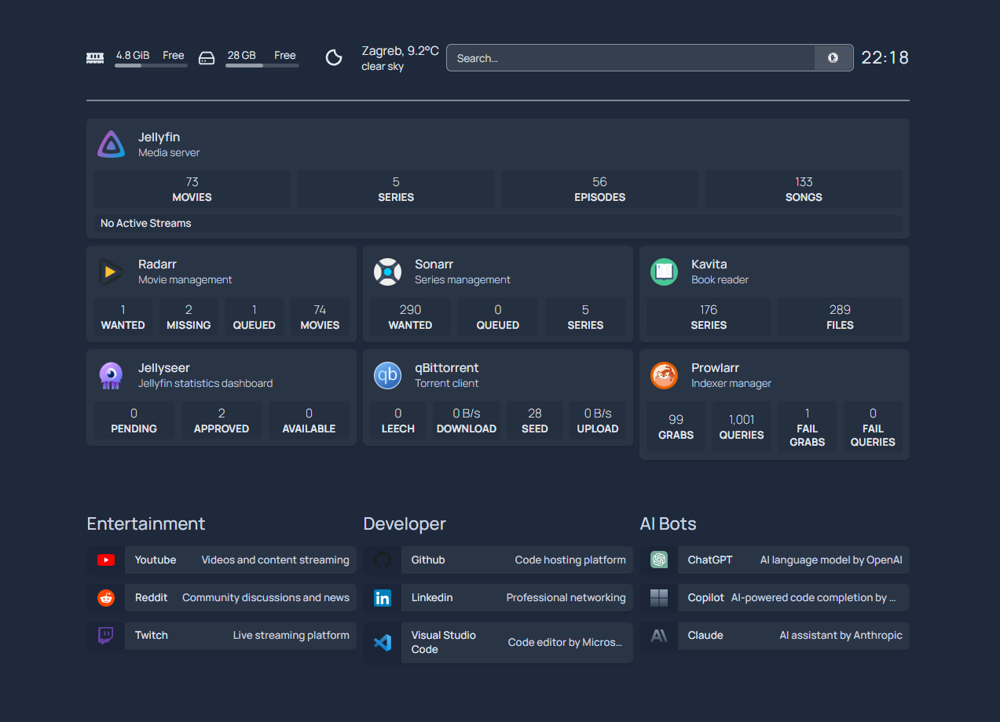

# Media Server — Automated Installer & Docker Stack



A fully automated, production‑grade media server setup powered by Docker, designed for clean organization, easy redeployment, and long‑term maintainability.

This project includes:

- A full‑screen **installer wizard** (whiptail)
- Automatic disk detection, formatting, and mounting
- Automatic creation of media folders
- Automatic Docker installation + compose wrapper
- Clean, modular Docker stacks:
  - **media‑stack** (Sonarr, Radarr, Jellyfin, Bazarr, Prowlarr, Kavita, Jellyseerr)
  - **downloads** (qBittorrent)
  - **infrastructure** (WireGuard, Pi‑hole, NPM, Code‑Server)
  - **monitoring** (optional)
- A fully variable‑based **Homepage dashboard**
- A consistent `.env`‑driven configuration system

---

# 🚀 Features

### ✔ Automated Installer

The `install.sh` script handles everything:

- Detects and mounts your media disk
- Creates `/share_media` and all subfolders
- Creates `/docker/appdata`
- Installs Docker + docker‑compose plugin
- Creates a global `dc` wrapper
- Deploys all stacks automatically
- Copies Homepage config into place

### ✔ Clean Folder Structure

SSD (fast configs):

```
/docker/appdata
```

HDD (media):

```
/share_media
   /tv
   /movies
   /anime
   /downloads
   /books
   /manga
   /comics
```

### ✔ Unified Container Paths

All containers see media under:

```
/mnt
```

This ensures perfect compatibility between:

- Sonarr
- Radarr
- Jellyfin
- Bazarr
- qBittorrent
- Kavita

### ✔ Homepage Dashboard

Fully variable‑based, no secrets in GitHub, auto‑loaded from:

```
/docker/appdata/homepage
```

---

# 📁 Repository Structure

```
.
├── install.sh
├── .env.example
│
├── media-stack/
│   └── docker-compose.yml
│
├── downloads/
│   └── docker-compose.yml
│
├── infrastructure/
│   └── docker-compose.yml
│
├── monitoring/        # optional
│   └── docker-compose.yml
│
└── config/
    └── homepage/
        ├── services.yaml
        ├── widgets.yaml
        ├── bookmarks.yaml
        ├── docker.yaml
        ├── settings.yaml
        ├── icons/
        ├── .env.example
        └── .env (ignored)
```

---

# ⚙️ Installation

### 1. Clone the repository

```bash
git clone https://github.com/EmanuelJrc/homelab
cd homelab
```

### 2. Make the installer executable

```bash
chmod +x install.sh
```

### 3. Run the installer

```bash
sudo ./install.sh
```

The wizard will guide you through:

- Selecting your media disk
- Formatting (optional)
- Mounting to `/share_media`
- Creating media folders
- Installing Docker
- Deploying all stacks

---

# 🏠 Homepage Configuration

Homepage config lives in:

```
config/homepage/
```

The installer copies this into:

```
/docker/appdata/homepage
```

Homepage automatically loads:

- `services.yaml`
- `widgets.yaml`
- `bookmarks.yaml`
- `docker.yaml`
- `settings.yaml`
- `.env` (for URLs + API keys)

Secrets are stored in:

```
config/homepage/.env
```

This file is **ignored** by Git.

---

# 🎬 Media Stack Overview

### Includes:

- **Sonarr** — TV automation
- **Radarr** — Movie automation
- **Prowlarr** — Indexer manager
- **Jellyfin** — Media server
- **Bazarr** — Subtitle manager
- **Kavita** — Book/manga/comic reader
- **Jellyseerr** — Request manager

---

# 📥 Downloads Stack

### qBittorrent

- Config: `${APPDATA}/qbittorrent`
- Downloads: `/mnt/downloads`
- Works with Sonarr/Radarr via category + path mapping

---

# 🔐 Infrastructure Stack

Includes:

- **WireGuard** — VPN
- **Pi‑hole** — DNS sinkhole
- **Nginx Proxy Manager** — Reverse proxy
- **Code‑Server** — VSCode in browser

All configs stored under `${APPDATA}`.

---

# 🧪 Testing Your Setup

After installation:

### Check Docker network

```bash
docker network inspect htpc
```

### Check containers

```bash
dc ps
```

### Check media mount

```bash
df -h | grep share_media
```

### Check Homepage

```
http://<server-ip>:3000
```

---

# 🧠 Troubleshooting

### Installer didn’t detect disk

Ensure the disk is connected and not mounted.

### Arr apps can’t import

Check:

- qBittorrent category
- Remote Path Mapping
- Permissions on `/share_media`

### Jellyfin can’t see media

Ensure libraries use:

```
/mnt/movies
/mnt/tv
/mnt/anime
```

---

# 🎉 Done
